<div align="center">

# GeoStrom
</div>

**This project aims at recreating a 2D game in C# language with Raylib library for the visuals.**<br/>
**The second goal of this project was to create my very first game in C#.**

## Information
Project start : 03/9/2022\
Project end : 03/15/2022\
Version : 1.0 - GOLD\
Date last version : 03/15/2022\

## Building
### Create an executable
```sh
$ Open GeoStorm.sln > Click on green arrow button
```
## Run
```sh
$ Open GeoStorm.sln > Click on green arrow button
```
## Game Preview
# MAIN MENU
- 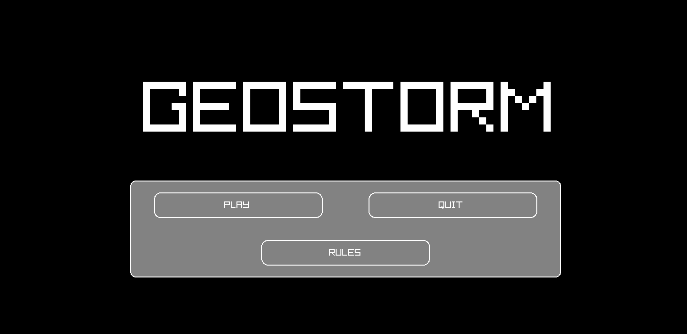
# RULES MENU
- 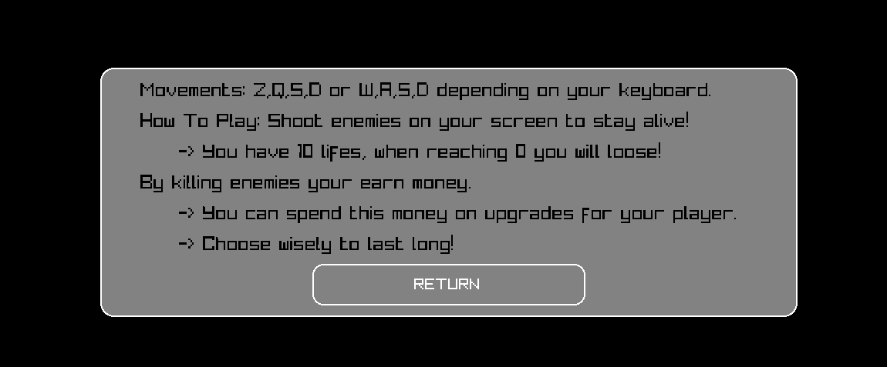

# PREVIEW PISTOL WEAPON
- 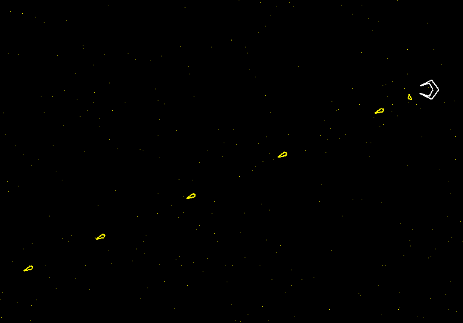
# PREVIEW SHOTGUN WEAPON
- 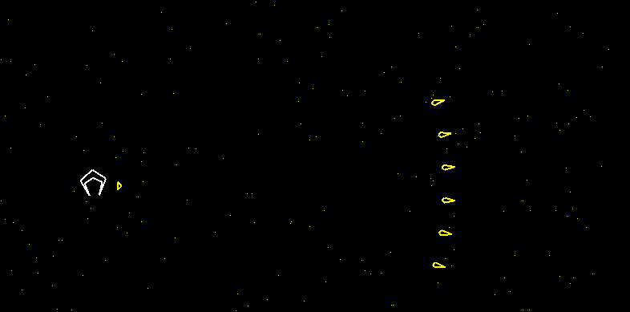
# PREVIEW LASER WEAPON
- 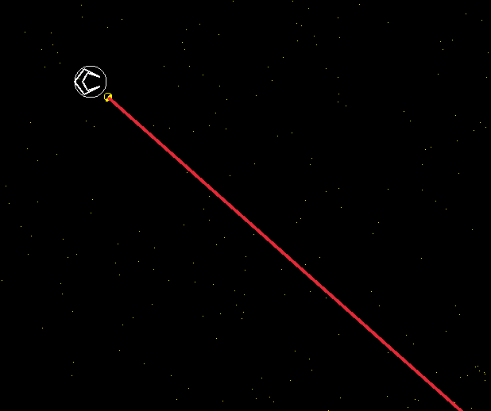
# PREVIEW LAUNCHER WEAPON (FOLLOW ENEMY)
- 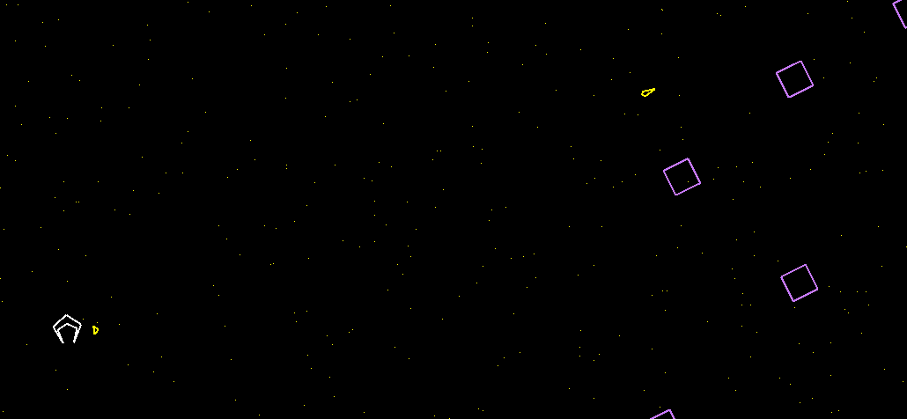
# PREVIEW CATAPULTE WEAPON (EXPLOSIONS)
- 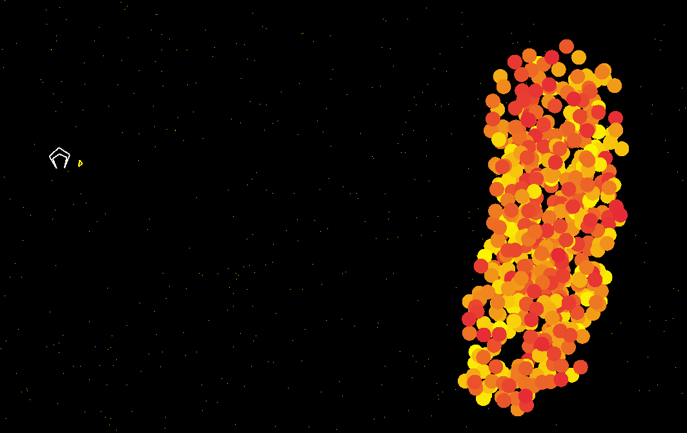

# DUMMY ENNEMY
- 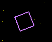
# STALKER ENEMY
- 
# SPINNER ENEMY
- 

# SHOP MENU
- 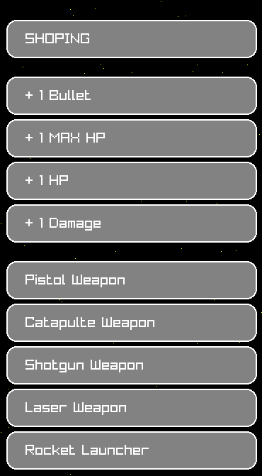
# DEBUG MENU
- 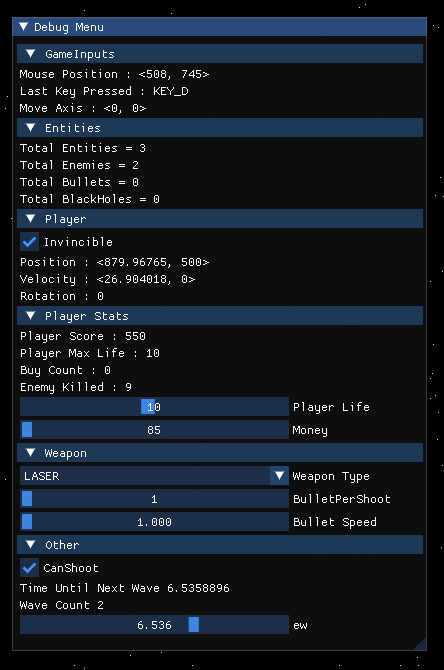
# PREVIEW GAMEPLAY
- 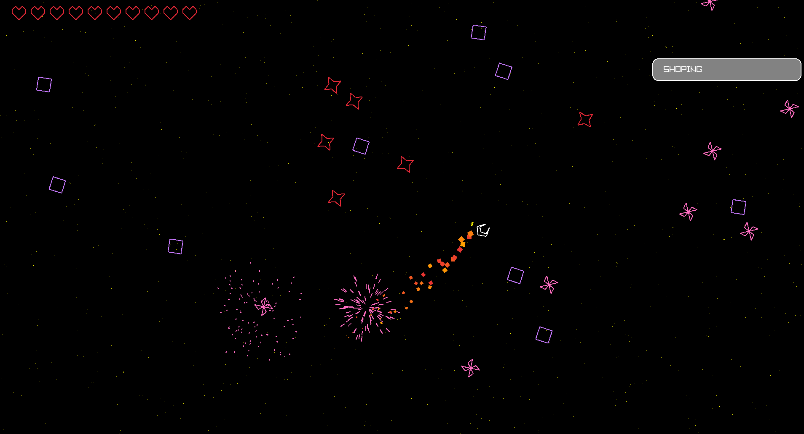
